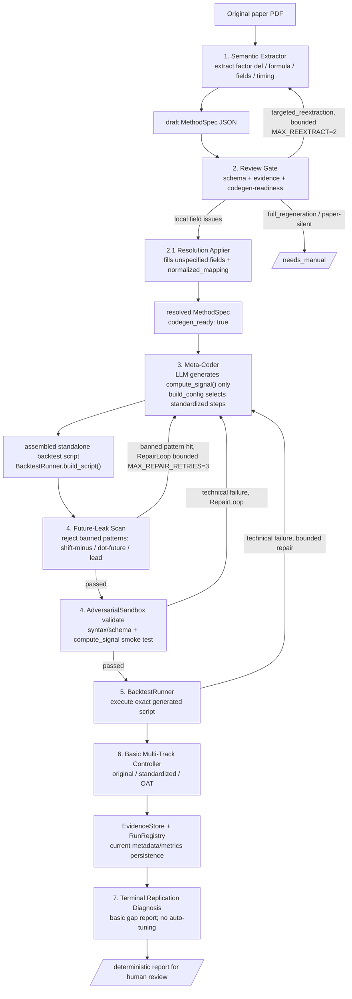

# Factor Replication Agent Architecture

> 中文名：**受控元代码生成的因子回测流水线与实现偏差归因框架**
> English title: **Controlled Meta-Coder Agents for Auditable Factor Backtesting Pipeline Generation and Implementation-Gap Attribution**

---

## 1. 项目定位 / Positioning

核心研究问题：

> 受控、防泄漏的 LLM agent 能否仅凭论文自动复现已发表因子的方法？其信号实现与
> 一个独立人工复现（C&Z）的**一致程度**（inter-implementer agreement），以及在
> 固定信号后因子对实现选择的**敏感度**，能揭示横截面资产定价文献的可复现性到什么
> 程度？同时保证回测过程可审计、时间上正确。

一句话概括：

> **让 LLM 写因子 signal，不让 LLM 控制实证结论。**

三个可分离的研究层次（详见 [replication-diagnosis-design.md](replication-diagnosis-design.md)）：

1. **提取保真度** —— agent 的 MethodSpec vs C&Z `SignalDoc`；
2. **信号实现一致性** —— agent 信号 vs C&Z 信号（rank correlation）；
3. **结论稳健性** —— 固定信号，只变实现参数，量化敏感度。

参考基准的角色（关键约束）：

- **C&Z** 是**独立人工复现**，用于度量 inter-implementer agreement——**不是**
  ground truth，**不是**原作者代码。因此代码/图示中"vs C&Z"一律指"与独立复现对比"，
  不得当作唯一真值。
- **HXZ** 是**标准化配置**来源与稳健性基准——一套我们施加在自己信号上的 config，
  而非可下载/可运行的外部结果。

**LLM 使用边界：** LLM 只出现在提取（Step 1）与 `compute_signal` 生成（Step 3），
Step 2 review 与最后分析的解释层为可选；所有实证数字（收益、t-stat、相关性、归因、
阈值）都由确定性代码产出，核心结论在关闭 LLM 时可复现。

---

## 2. 核心设计原则 / Design Principles

| 原则 | 说明 |
|---|---|
| LLM 只生成 signal | `compute_signal()`（纯因子公式）由 LLM 生成；回测的所有步骤都由 BacktestExecutor 的固定标准实现处理，**不生成任何 hook 代码** |
| 回测骨架固定，步骤顺序不变 | 固定顺序的执行链路（见 §3、§4.6），单一标准路径（单维、连续分位数、`portfolio_sort` estimator），顺序本身不允许 LLM 改变 |
| 组合构建从固定菜单里选，不生成代码 | BacktestExecutor 对每个步骤维护一份固定菜单（weighting vw/ew、breakpoints nyse/full_sample、missing drop、return_combination、estimator 等）；MethodSpec 字段值若超出菜单，`registry.build_config` 确定性地钳制到菜单默认值（`_clamp`），绝不生成代码 |
| paper-first MethodSpec | 从论文原文提取方法事实；C&Z / OSAP 只作 evaluation，不覆盖 paper-stated 内容 |
| 所有决定都在 MethodSpec 里 | Resolution Applier 将 unspecified 字段决定写入 MethodSpec 的具体字段（`resolution_log` 追踪来源）；列名映射写入 `data.normalized_mapping`；不维护单独的 impl_config 文件 |
| 反馈回路有界 | Review→Extractor 定向重抽最多 2 次；技术修复使用共享 `RepairLoop` 的独立重试预算；超过即转人工干预 |
| paper-stated 但引擎不支持的取值不静默丢弃 | `unspecified`（论文没说）与 `other`（论文说了但不在标准菜单，如 `weighting="capped_vw"`）是两个不同的枚举成员；后者由 `MethodSpec.unsupported_fields` 忠实保留论文原值，`registry.build_config` 是唯一确定性替换点并记录 `substitutions`，见 §4.2a |

---

## 3. 流水线 / Pipeline

```text
Paper PDF
  → 1. Semantic Extractor: paper-first draft MethodSpec
  → 2. Review Gate + Resolution: evidence checks, human decisions, source mapping
       ↳ targeted re-extraction only for cited extraction errors (bounded)
  → 3. Meta-Coder: generate formula-only compute_signal(); resolve engine config
  → 4. Validator: future-leak scan + syntax/schema + compute_signal smoke test
  → 5. BacktestRunner: execute the exact generated script in a subprocess
  → 6. Basic Multi-Track Controller: original / standardized / OAT runs
  → 7. Terminal Replication Diagnosis: deterministic gap report, no automatic tuning

EvidenceStore and RunRegistry are shared infrastructure, not numbered stages.
The full declarative multi-config matrix, complete evidence bundle, C&Z bridge,
and persisted diagnosis report are designed but not yet implemented.
```

### 3.0 Pipeline 流程图 / Pipeline Flowchart



### 3.1 反馈回路 / Feedback Loops

> **2026-07-22 重设**：`Pipeline.run_full_pipeline()` 现在有**两条真正实现的、
> 有界的自动回路**（见下表）。设计信条：每条回路只回传"问题在哪 / 该重新看哪里"，
> **绝不回传答案**——技术回路不替 LLM 写正确代码，经验回路不替 extractor 填正确
> 数值。经验结论始终由人在环的 Review Gate 前置把关；后续阶段（ReplicationDiff）
> 只如实报告复现差异，**不做任何自动经验回退**。三处历史上重复的技术回路已统一为
> 一个共享的 `RepairLoop`（`src/infra/repair.py`）。详见 `docs/decision-log.md`。

`src/pipeline.py` 的 `Pipeline.run_full_pipeline()` 目前实现的回路：

| 触发条件 | 回路方向 | 上限 | 实现状态 |
|---|---|---|---|
| 技术性失败（syntax/schema/未来泄漏/执行崩溃） | Sandbox/执行 → Meta-Coder 重新生成代码 | `MAX_REPAIR_RETRIES = 3` | ✅ 已实现：统一在共享 `RepairLoop`，被 `run_from_method_spec` / `run_full_pipeline` / `DualTrackController._run_track` 共用；每次尝试记 `RepairAttempt` 审计 |
| LLM Reviewer 判定高影响字段被**误抽**（`remediation_mode == TARGETED_REEXTRACTION`，且该字段有论文原文引用） | Review Gate → Extractor 定向重抽 | `MAX_REEXTRACT = 2` | ✅ 已实现：带 reviewer 的论文原文引用重抽被标字段 → 重审；超预算/无可用引用/论文确实没写 → 转人工 |
| Review 判 `FULL_REGENERATION` 或论文确实沉默（无原文引用） | → 人工 | — | ✅ 直接 `needs_manual`（不消耗重抽预算），不自动重来 |
| 复现结果与参考（C&Z/论文）有差距 | ReplicationDiff 报告（终点，**不回流**） | — | ✅ 设计上不做自动经验回退，只报告 gap 供人解读 |

**技术回路 vs 经验回路的红线**：技术回路里 `MetaCoder.repair_plugin` 的 prompt 写死
"只修代码、不碰经验假设"；经验回路里 extractor 只被要求"重读这段论文原文、重新核对
这个字段"，最终值仍由 extractor 从论文抽、由 Review 再判。这保证了 LLM 永远不自行
决定经验性结论。

流水线阶段状态机：`pending → extract → review → reextract → generate → validate → run → replication_diff → done / failed`。

---

## 4. 各模块说明 / Module Details

### 4.1 Semantic Extractor

从 original paper 提取 paper-first MethodSpec。

- 输入仅限论文文本 + data dictionary（字段名校验）；不读 C&Z / OSAP
- 提取内容：factor definition、formula、data fields、timing、lag、universe、breakpoints、weighting、missing policy 等
- paper 未明确的字段标注 `status: unspecified / inferred / conflicting`，写入 `ambiguous_fields`
- 输出：`draft MethodSpec JSON`（schema: `methodspec.v1`）

评估：提取完成后将 MethodSpec 与 C&Z SignalDoc.csv 逐字段对比，计算 extraction accuracy。差异记入 eval report，**不回灌修正 MethodSpec**。

### 4.2 Review Gate

审查 MethodSpec 的可信度和 codegen-readiness。

审查内容：
- schema 是否符合 `methodspec.v1`
- 关键假设是否有 paper citation
- timing、lag、sign、weighting、reported results 是否一致
- 高影响字段（formula / lag / universe / breakpoints / weighting）是否有清晰 evidence

输出 review report，包含 `review_status`、`codegen_ready`、`remediation_mode` 和逐字段 resolution 建议。

修复模式（`remediation_mode`）：

| 模式 | 使用时机 |
|---|---|
| `resolve_existing_json` | 局部字段级问题，paper evidence clear |
| `targeted_reextraction` | 高影响字段可能整体误读，但 target 大体可信 |
| `full_regeneration` | JSON 大面积不可信（极少用）|

高影响字段（改变会 materially affect 实证结果）：`formula`、`timing.*`、`universe.*`、`portfolio.sort.*`、`portfolio.weights`、`reported_results.*`。

### 4.2a MethodSpec 保真度：`unspecified` vs `other`（2026-08 新增）

`WeightingRule`/`BreakpointSource`/`MissingAction` 各有一个 `other` 枚举成员，与
`unspecified` 语义严格区分，二者绝不可合并展示：

| 取值 | 含义 | 处理 |
|---|---|---|
| `unspecified` | 论文**没有**提及这个选择 | Review Gate 走既有 paper-silent 检查（`_check_silent_high_impact_fields`），走 `SENSIBLE_DEFAULTS` |
| `other` | 论文**明确说了**一个值，但不是标准菜单成员（如 `weighting="capped_vw"`） | 论文原值忠实记录在 `MethodSpec.unsupported_fields`（纯描述性，不做替换决定）；`registry.build_config` 是唯一确定性替换点，把 `other` 钳到菜单默认值并输出 `config["substitutions"]`；Review Gate 的 `_check_unsupported_fields` 单独呈现，避免被误认为论文没说 |

设计原则：标准菜单（目前只有 `vw`/`ew` 等）永远不为某个非常规方案膨胀；MethodSpec
只负责忠实保留论文原值，引擎标准化和 clamp 决定完全独立、确定性、可审计。详见
docs/decision-log.md 2026-08-02 条目。

### 4.3 Meta-Coder

Meta-Coder 只生成 `compute_signal()`（纯因子公式）。所有组合构建方法由
`registry.build_config` 从固定菜单选择；菜单外的论文取值由确定性规则替换并记录，
不生成额外执行代码。

输入 resolved MethodSpec（`spec.data.normalized_mapping` 已填充，所有字段已 resolved），生成 per-factor plugin：

**LLM 代码生成**

```
signal_plugin_{factor_id}.py
  └── compute_signal(df)                   ← 所有因子必有，LLM 生成，且仅此一项
        接收 keyed [permno, time_avail_m] 的 annual df
        使用 spec.data.normalized_mapping 提供的物理列名
        只做公式计算，禁止处理 lag
        输出 [permno, yyyymm, signal]
```

Meta-Coder 还实现 `repair_plugin(plugin, errors)`，在 Future-Leak Scan 命中后重新生成（≤ `MAX_REPAIR_RETRIES = 3` 次）。

### 4.4 Future-Leak Scan

在 plugin 运行前做唯一必要的安全检查：扫描生成代码中的禁用模式。

禁用模式：`shift(-`、`.future`、`lead(`

命中即拒绝，返回 Meta-Coder 重新生成（最多 3 次）。其余检查（语法、schema、reproducibility）运行时自然暴露，无需静态扫描。

### 4.5 Data Layer（DataSource 注册表 + 声明式加载）

数据层使用 **CRSP-centric DataSource 注册表**；
`src/infra/data_layer/sources.py` 是唯一真相源，`catalog.py` 的查询视图
（`DATA_CATALOG`/`LINK_TABLES`/`RETURNS_UNIVERSES`/`signal_sources`/
`concept_map`/`source_of_column`/`resolve_concept`）全部从注册表派生。

分层(单向依赖 `sources.py ← catalog.py ← __init__.py`):

- **`sources.py`** —— `DataSource` 抽象 + 注册表:
  - `ReturnsUniverse`(自定义 class):`CrspReturnsUniverse` 从真实 WRDS "new CIZ"
    导出(`CRSP_STOCK_MONTH.csv` + `CRSP_DELISTING.csv`)组装月度收益骨架
    `[permno, yyyymm, ret, me, exchcd, shrcd, siccd, dlret]`;按 alias
    `us_equity_crsp` / layout tag `crsp_ciz` 寻址。
  - `SignalSource`(声明式 `SourceSpec`):`comp_funda`/`comp_fundq`/`ibes_statsumu`
    各一条声明;`crsp_msf` 是 `CrspSignalSource`(CRSP 的信号双角色)。
  - `LinkTableSpec` 注册表:`ccm`(gvkey→lpermno,含 linktype/linkprim 过滤 +
    linkprim=='P' tie-break)、`ibes_crsp_link`(ticker→permno)。
  - 加载:`assemble_signal_master_table(spec, data_dir)` →
    读各源需要的列 → `link_to_permno` 时点链接到 permno →
    `time_avail_m = 观测月 + lag` → 按 `[permno, time_avail_m]` 外连接。
    signal plugin 只读列,不处理 lag(lag 属于数据层,AGENTS.md 硬约束)。
- **`catalog.py`** —— 从注册表派生的查询视图(与历史字面量逐字节兼容,MethodSpec/
  reviewer 零改动)。
- **`__init__.py`** —— `DataLayer` 门面(`load_returns`/`load_returns_by_layout`
  经注册表加载收益面板)+ `DataDictionary` + `SnapshotManager`(可复现实验的
  冻结数据登记 + UI 选择器,与 DataSource 正交)。

**快照布局**:一个 snapshot 目录含 `crsp_msf.parquet`(收益面板)+
`comp_funda.parquet`(声明式信号源)+ `ccm_lnkhist.parquet`(CCM 链接表,键
`lpermno`)。生成的回测脚本 compustat/multi_source 模式都经
`assemble_signal_master_table_from_sources` 从该目录装配信号主表。

**新增一个数据源** = 在 `sources.py` 注册一条 `SourceSpec`(声明 native key /
observation date / lag / CRSP link / raw_filters),人工一次性登记;reviewer 硬
阻断未注册源。


### 4.6 BacktestExecutor：标准化步骤菜单

引擎只有一条标准路径：单维连续分位数排序 + `portfolio_sort` estimator。
每个组合构建参数由 `registry.build_config` 从固定菜单选择；菜单外取值被确定性替换，
替换记录进入 config provenance。

`src/infra/backtest_engine/` 现在只有**一个文件**：

| 文件 | 职责 |
|---|---|
| `__init__.py` | `BacktestExecutor` 的编排和每一步计算实现。`run_with_config()` 按固定顺序调用 step 方法；纯工具函数使用 `@staticmethod`。数据加载通过 DataLayer/DataSource registry，而不是引擎内的文件格式分支。 |

`build_config()` 等 MethodSpec-to-config 选择逻辑住在
`src/steps/step3_codegen/registry.py`；生成脚本与引擎 convenience `run()` 都调用这一
份实现，不维护第二套兼容委托。

单一执行路径：`src/steps/step3_codegen/script_generator.py` 生成的独立脚本是薄封装，直接 `import BacktestExecutor` 调 `run_with_config()`，不再内联重复实现执行链路——engine 与生成脚本不可能再互相漂移。

**固定菜单 + 钳制（`registry.build_config` / `_clamp`）**：每个组合构建参数只有一组固定的内置实现，`build_config` 从菜单里*选择*，MethodSpec 里超出菜单的取值被**确定性钳制到菜单默认值**（`_clamp`），绝不生成代码。菜单取值直接引用 `src/infra/models/method_spec.py` 里的枚举：

```python
STANDARD = {
    "breakpoint_source":  {"full_sample", "nyse"},   # 默认 full_sample
    "weighting":          {"vw", "ew"},               # 默认 vw
    "missing_action":     {"drop", "unspecified"},    # 恒定 drop
    "return_combination": {"extreme_group_spread", "average_leg_spread",
                            "single_signal_portfolio_return", "full_portfolio_return",
                            "unspecified"},            # 默认 extreme_group_spread
}
```

（`cat_form`/`portfolio_construction` 两项已随 discrete 排序、Fama-MacBeth estimator 一起移除。）

`filter_universe` 只应用 `portfolio.universe_filters` 的 `FilterOp` DSL（`apply_universe_filters`，覆盖全部 14 个 FilterOp 取值），完全确定性。

因为 `portfolio.construction_type`/`return_combination` 字段容易在提取阶段漏填，ReviewGate 的 `_check_portfolio_structure_consistency` 会在自由文本明显暗示复杂结构但结构化字段为空时发出**警告**（不再 block）——引擎此时跑菜单默认（单排序），残差由 step7 的复现差距分析解读。

**标准步骤实现（所有因子共用，固定执行顺序，`run_with_config()` 中依次调用）：**

| # | 方法 | 实现 |
|---|---|---|
| 1 | `load_data` | 从注册的 returns universe/DataLayer 取得标准收益面板 |
| 2 | `apply_delisting_returns` | 有 `dlret` 列时按 CRSP 惯例并入 `ret`；无该列则 no-op |
| 3 | `apply_missing_policy` | 恒定 drop（引擎标准化为 drop NaN） |
| 4 | `filter_universe` | 只应用 `portfolio.universe_filters` 的 FilterOp DSL（论文的样本限制，包括常见的"普通股/主要交易所/排除金融股"这条 boilerplate，统一由 extractor 提取进 `universe_filters`） |
| 5 | `apply_excess_returns` | 有 `factors`（含 `rf`）且 `return_basis=excess`（默认）时减去无风险利率；否则 no-op |
| 6 | `apply_signal_holding_period` | 年度 signal 展开持有，按 `rebalance_frequency` 封顶持有窗口；每行打上形成 `cohort` 标签，供下一步锁定断点（2026-07-24 formation-locked 修复） |
| 7 | `form_portfolios` | 断点计算 + 分组一次完成；断点/分组按 **cohort（形成月）锁定**，不是按当前月现算——组合归属在整个持有期内固定不变（form-once-hold-fixed，Fama-French/Ken French Data Library 惯例） |
| 8 | `compute_portfolio_returns` | 各组合自己的月度收益：VW（`me` 权重）或 EW |
| 9 | `combine_portfolio_returns` | 把 Step 8 各组合的收益合成最终对外报告的收益序列；支持 `extreme_group_spread`/`average_leg_spread`/`single_signal_portfolio_return`/`full_portfolio_return` 四种组合方式（不总是 long-short 价差） |
| 10 | `compute_metrics` | 月度均值、Newey-West t-stat、Sharpe；有 `factors` 时额外调用 `compute_factor_alphas`（CAPM/FF3/FF5，`statsmodels` OLS+HAC） |

归因前提：可比较的 agent runs 必须共享同一个冻结 plugin；当前 per-track repair 仍可能
破坏这个前提，因此完整 multi-config matrix 会在批次启动前冻结 plugin，并在违反时
使整个批次失效。详见 [multi-config-evidence-plan.md](multi-config-evidence-plan.md)。

### 4.6.1 BacktestExecutor 流程图 / Backtest Engine Flowchart


---

## 5. 文件结构 / File Layout

```
app.py                          # 完整 Streamlit 研究 UI（迁移期间保留）
backend/                        # FastAPI API/SSE 层；复用 src/ 逻辑，不重写实证逻辑
frontend/                       # React/Vite UI；Pipeline/Backtest/Trace 页面已实现

data/
  paper_text_cache/             # PDF 转换后的文本缓存（审计用）
  eval_history/                 # 批量 extraction accuracy 评估记录
  test_method_specs_human_labeled/  # 人工标注的 Curated Reference MethodSpec（仅事后评估）
  local/                        # 开发者本地真实数据（gitignored；见 §10）
    CRSP_STOCK_MONTH.csv        # 真实 WRDS "new CIZ" 月度导出（收益骨架来源）
    COMPUSTAT_FUNDAMENTALS_ANNUAL.csv  # Compustat annual
    CRSP_COMPUSTAT_LINK.csv     # CCM 链接表（gvkey→lpermno）

runs/                            # ⚠ gitignored — 所有 pipeline 运行时生成的产物统一放这里
  method_specs/
    unreviewed/                 # raw extracted MethodSpec（未审查）
    reviewed/                   # reviewed MethodSpec + review report
    resolutions/                # Review Gate 生成的逐字段 resolution 建议
    resolved/                   # post-resolution MethodSpec（codegen_ready: true）
                                 # 含 data.normalized_mapping + resolution_log
  plugins/                      # 生成的 per-factor signal plugin Python 文件
  backtest_scripts/             # generate_backtest_script() 生成的独立可运行回测脚本
    results/                    # 脚本自己写的 CSV/metrics.json（临时，随时可删）
  evidence/                     # EvidenceStore 输出目录：{factor_id}/{run_id}/metadata.json

tests/
  fixtures/                     # ⚠ 提交进 git —— 测试 & 手动调试用的固定参考样本
    method_specs/               # golden-number 测试依赖的 resolved MethodSpec
    plugins/                    # 对应的已验证 signal plugin

src/
  pipeline.py                   # Pipeline 主编排器（含反馈回路，见 §3.1）
  steps/                        # 7 个流水线阶段，按数字前缀排序（Python 标识符不能以纯数字开头）
    step1_extractor/             # Semantic Extractor
    step2_reviewer/               # Review Gate + Resolution Applier
    step3_codegen/                 # MetaCoder（generate_plugin + repair_plugin）+ registry.build_config +
                                  # script_generator.generate_backtest_script（组装独立回测脚本）
    step4_validator/               # Future-Leak Scan + 插件语法/schema/沙箱冒烟测试
    step5_backtest_runner/          # BacktestRunner.build_script() / .execute()（跑 step3 组装好的脚本）
    step6_dual_track_controller/     # DualTrackController + ExperimentPlan + HXZ_STANDARD_CONFIG
    step7_replication_diff/          # ReplicationDiff + ReplicationDiffResult
  infra/                        # 跨 step 共享基础设施（无 LLM hook 加载，纯标准化实现）
    pdf_mapper.py                 # PDF 文件名 ↔ factor_id 映射工具
    llm.py                        # LLM client（支持 OpenRouter / Claude CLI / Codex）
    trace.py                      # Pipeline 执行事件日志
    repair.py                     # 共享 RepairLoop（技术性修复回路）
    backtest_engine/               # BacktestExecutor（单一文件 __init__.py：编排 + 每步计算）
    data_layer/                    # sources.py（DataSource 注册表=唯一真相源）+ catalog（派生视图）+ DataLayer 门面 + DataDictionary + SnapshotManager
    evidence/                      # EvidenceStore + RunRegistry
    models/                        # Pydantic models（MethodSpec、PluginRecord、RunRecord …）
    registry/                     # Pipeline 使用的 in-memory PluginRegistry
  evaluation/                   # 事后 reference parsing/scoring helpers

scripts/
  extract_methodspecs.py        # CLI：从 PDF 批量提取 MethodSpec
  review_methodspecs.py         # CLI：批量 LLM review
  resolve_review_blocks.py      # CLI：批量应用 resolution
  validate_methodspecs.py       # CLI：校验 MethodSpec schema
  convert_papers_to_md.py       # PDF → Markdown 转换
  download_papers.py            # 下载论文 PDF
  download_osap.py              # 下载 OSAP 数据
```

---

## 6. 端到端流程示例 / End-to-End Example

### 6.1 Streamlit Dashboard（完整研究 UI）

```bash
# 启动 dashboard（需先激活 virtualenv）
source .venv/bin/activate
streamlit run app.py
# 浏览器访问 http://localhost:8501
```

Dashboard 覆盖完整人工环节：PDF 上传 → 提取 MethodSpec → LLM 审查 → 应用 resolution → MetaCoder 生成 plugin → Sandbox 验证。

### 6.2 React + FastAPI（迁移目标）

`backend/` 只暴露 `src/` 的既有逻辑；`frontend/` 已实现 Pipeline、Backtest、Trace
页面，其余页面仍在迁移。迁移完成前两套 UI 共存，实证逻辑只保留在 `src/`。

```bash
.venv/bin/python -m uvicorn backend.main:app --reload --port 8000
cd frontend && npm run dev
```

### 6.3 CLI 脚本（批量 / 无界面）

```bash
# Step 1: 从 PDF 提取 MethodSpec
python scripts/extract_methodspecs.py --pdf papers/cgs2008.pdf --provider claude

# Step 2: LLM review
python scripts/review_methodspecs.py --factor cooper_gulen_schill_2008_asset_growth

# Step 3: 应用 resolution（审查后生成 codegen_ready=true 的 JSON）
python scripts/resolve_review_blocks.py --factor cooper_gulen_schill_2008_asset_growth

# Step 4: 通过 Pipeline 生成 plugin + 运行实验（需先准备 data/local/*.parquet 并注册 snapshot）
python - <<'EOF'
from src.pipeline import Pipeline
pipeline = Pipeline()
runs, status = pipeline.run_factor(
    factor_id="cooper_gulen_schill_2008_asset_growth",
    snapshot_id="<registered snapshot id>",
    paper_text=open("data/paper_text_cache/cgs2008.txt").read(),
)
print(status)
EOF
```

---

## 7. Basic Multi-Track Controller / 基础多轨实验控制器

当前代码实现 `original_method` / `standardized_hxz` / `ablation_*` 的基础编排，
尚不构成完整 replication diagnosis。C&Z 只在 agent 产物冻结后作为 MethodSpec、
firm-level signal 和 portfolio-return reference；标准化 profile 只承担 robustness。

作用：

> 用同一个 signal plugin，在不同 implementation settings 下运行实验。

主要 track：

| Track | 作用 |
|---|---|
| `original_method` | 尽量忠实复现 original paper stated method；C&Z / OSAP 只作 diagnostic comparison |
| `standardized_hxz` | 用统一 HXZ-style 设置做标准化 robustness test |
| `ablation_*` | 每次只改变一个 implementation choice |

目标原则是不同 track 共享一个冻结 signal plugin，只改变批准的 config。不过当前
controller 仍允许 per-track technical repair，因此这个不变量尚未被可靠强制；完整
matrix 会改为批次启动前冻结 plugin，违反时使整个批次失效。

`original_method` 应该遵守原文的回测周期：formation month、rebalance frequency、holding period、return horizon、skip month、accounting lag、overlapping portfolios 等。这些由 MethodSpec 提取、经 Review Gate 审查后，由回测骨架执行。

`standardized_hxz` 当前使用代码中固定的标准化规则（lag=6m、NYSE 断点、VW、monthly rebalance、holding period=1m 等），配置见 `src/steps/step6_dual_track_controller/__init__.py` 中的 `HXZ_STANDARD_CONFIG`。这些设置是否应继续称为 “HXZ-style” 是下一轮双轨设计需要明确的研究口径，而不是已被外部基准验证的事实。

**多配置对比的完整设计（尚未实现）：** 研究需要的是把
同一个冻结信号跑在多套受控 config 下、把结果和确切 config 一起唯一持久化、再做
确定性对比（可选叠加 LLM 解释层）。完整设计见
[multi-config-evidence-plan.md](multi-config-evidence-plan.md)（中文唯一版本），核心要点：

- **run 身份先于执行分配**：`config_hash` 在 `build_script` 之前算好，多 track
  的脚本/输出目前用裸 `factor_id` 命名会互相覆盖（现存 bug，见该文档 D1/D2）；
- **per-key stage taxonomy 取代二元分类**：每个 config key 标注
  `signal_input`（pre-signal）或 `portfolio`/`universe`/`sample`/`estimator`
  （post-signal），归因等级由两次 run 的 resolved-diff 自动算出，而非手写
  family；
- **plugin 冻结在矩阵启动前完成**：矩阵运行期间禁止 track-local repair，否则
  不同 track 的 `code_hash` 会分叉、污染 config 归因（现存 bug，见 D5）；
- **声明式实验矩阵**：`experiments/<factor_id>.experiments.yaml`，取代现在
  硬编码在 Python 里的 `ExperimentPlan`；
- **bridge 实验（C&Z 信号 × 我们引擎）是唯一额外要跑的 backtest**，用于隔离
  信号实现差异，而不是 portfolio 差异。

---

## 8. Evidence Store + Run Registry / 证据存储与运行注册表

作用：

> 保存每次实验的所有关键信息，使结果可复查、可复现、可审计。

当前每次 run 记录：

- run id、factor id、plugin id
- MethodSpec version / hash、generated code hash
- implementation config hash（snapshot hash 仍可能为空）
- metrics（spread、t-stat、alpha 等）
- logs、status

完整 signal/return/intermediate artifacts、canonical paths、runtime provenance 与
atomic bundle ingest 尚未实现，见 multi-config plan Phase A1。

Run Registry 记录每个 factor × variant 的状态：`pending / running / success / failed / needs_review`。

---

## 9. Terminal Replication Diagnosis / 终点复现诊断

当前作用是报告 `original_method` 与 `standardized_hxz` 的结构性差异；完整目标是用
受控 bridge 与 config pairs 诊断信号、portfolio、data 和统计差异。

回答的问题：

- 差异有多少来自 universe？
- 有多少来自 breakpoint？
- 有多少来自 weighting？
- 有多少来自 accounting lag？
- 有多少来自 rebalance frequency？
- 有多少来自 missing-value policy？
- 是否存在 interaction effects？

当前实现 one-at-a-time t-stat 差值计算。交互分析、bridge decomposition 和完整
diagnosis 尚未实现。

目标输出是 persisted `ReplicationDiagnosisReport` 与 cross-factor summary；当前
`Pipeline` 调用基础 diff 后丢弃结果，尚未持久化或返回。

异常（例如 t-stat 符号翻转或 gap 很大）只进入报告并交由研究者判断，不自动触发 Review Gate，也不自动修改 MethodSpec 或经验参数。

每条归因结论都必须携带 identification level（`controlled` / `harmonized` /
`observational` / `unidentified`，design §5.2），并区分声明的实验 family 与算出的
level——不能互换展示。这一层还依赖尚未实现的 bridge 实验（C&Z 信号 × 我们引擎）
来隔离信号实现差异 vs portfolio 参数差异，完整设计见
[multi-config-evidence-plan.md](multi-config-evidence-plan.md) Phase C/D。

---

## 10. 模块实现状态 / Implementation Status

| 模块 | 状态 | 说明 |
|---|---|---|
| Semantic Extractor | ✅ 已实现 | LLM 提取 + data dictionary 校验 |
| Review Gate | ✅ 已实现 | rule-based + LLM review，`review_with_llm()` |
| Resolution Applier | ✅ 已实现 | 字段级 patch，`codegen_ready=true` 写入 |
| Meta-Coder | ✅ 已实现 | 只生成 `compute_signal()`（纯公式）；读 `spec.data.normalized_mapping` |
| Future-Leak Scan | ✅ 已实现 | 扫描 `shift(-`/`.future`/`lead(`，命中即拒绝重生成 |
| Plugin Registry | ✅ 内存实现 | Pipeline 注册/查询 plugin；跨进程持久化随完整 evidence bundle 实现 |
| Evidence Store + Run Registry | 🚧 部分实现 | 当前只稳定写 `metadata.json`；完整序列/中间产物/runtime provenance 未实现 |
| Basic Multi-Track Controller | 🚧 部分实现 | `ExperimentPlan` + `HXZ_STANDARD_CONFIG` + OAT 编排已存在；严格 config 校验、plugin 批次冻结、factorial matrix 未实现 |
| Pipeline 反馈回路 | ✅ 两条回路已实现 | `src/pipeline.py`，见 §3.1——技术性修复（共享 `RepairLoop`，`src/infra/repair.py`）+ Review→Extractor 定向重抽（`MAX_REEXTRACT=2`）；ReplicationDiff 为终点报告不回流 |
| Streamlit Dashboard | ✅ 已实现 | `app.py`，覆盖 extract → review → resolve → codegen |
| BacktestExecutor standard steps | ✅ 已实现 | 10 个 standard step 方法；config 从固定菜单解析 |
| BacktestExecutor 步骤路由 | ✅ 已实现 | 单一标准路径，`run_with_config()` 按固定顺序调用 step 方法；见 §4.6 |
| Replication diagnosis | 🚧 基础结构已有 | `ReplicationDiffResult` 与基础 t-stat gap；结果未持久化/返回，bridge 与完整分解未实现 |
| MethodSpec `unspecified` vs `other` | ✅ 已实现 | `WeightingRule`/`BreakpointSource`/`MissingAction` 的 `OTHER` 成员 + `unsupported_fields` + `registry.build_config` substitutions + `ReviewGate._check_unsupported_fields`；见 §4.2a、`tests/test_unsupported_fields.py` |
| 多配置证据持久化（Phase 0–E） | 📝 设计完成，未实现 | run 身份/config 校验/唯一路径/信号与中间产物持久化/实验矩阵声明层/bridge 实验，见 [multi-config-evidence-plan.md](multi-config-evidence-plan.md)；当前脚本/输出仍用裸 `factor_id` 命名，会被多 track 覆盖 |
| Real-data inputs | 用户提供 | 支持本地 WRDS CIZ/Compustat/CCM/IBES CSV/Parquet；无 live WRDS service |
| Plugin hash 持久化 | ⏳ 未实现 | Plugin Registry 当前为 in-memory；需要跨进程追溯时扩展到磁盘 |
