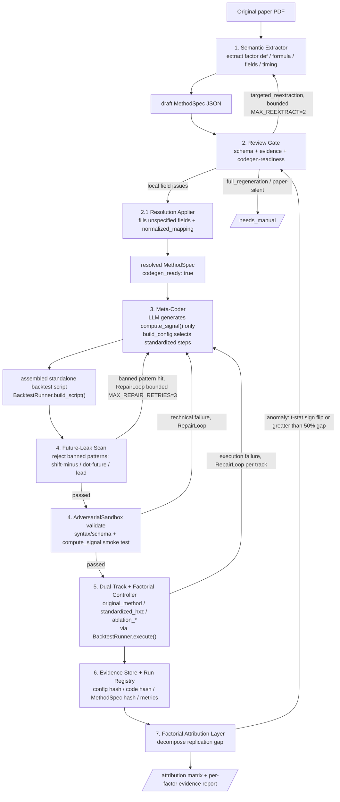
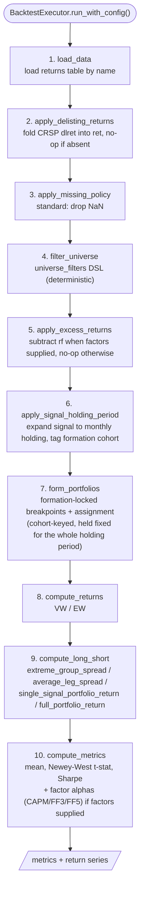

# Factor Replication Agent Architecture

> 中文名：**受控元代码生成的因子回测流水线与实现偏差归因框架**
> English title: **Controlled Meta-Coder Agents for Auditable Factor Backtesting Pipeline Generation and Implementation-Gap Attribution**

---

## 1. 项目定位 / Positioning

核心研究问题：

> LLM 能否根据学术论文中的因子描述，自动生成因子信号构造代码，同时保证回测过程可审计、时间上正确，并且能够解释不同实现方式造成的 replication gap？

一句话概括：

> **让 LLM 写因子 signal，不让 LLM 控制实证结论。**

---

## 2. 核心设计原则 / Design Principles

| 原则 | 说明 |
|---|---|
| LLM 只生成 signal | `compute_signal()`（纯因子公式）由 LLM 生成；回测的所有步骤都由 BacktestExecutor 的固定标准实现处理，**不生成任何 hook 代码** |
| 回测骨架固定，步骤顺序不变 | 固定顺序的执行链路（见 §3、§4.6），单一标准路径（单维、连续分位数、`portfolio_sort` estimator），顺序本身不允许 LLM 改变 |
| 组合构建从固定菜单里选，不生成代码 | BacktestExecutor 对每个步骤维护一份固定菜单（weighting vw/ew、breakpoints nyse/full_sample、missing drop、return_combination、estimator 等）；MethodSpec 字段值若超出菜单，`registry.build_config` 确定性地钳制到菜单默认值（`_clamp`），绝不生成代码 |
| paper-first MethodSpec | 从论文原文提取方法事实；C&Z / OSAP 只作 evaluation，不覆盖 paper-stated 内容 |
| 所有决定都在 MethodSpec 里 | Resolution Applier 将 unspecified 字段决定写入 MethodSpec 的具体字段（`resolution_log` 追踪来源）；列名映射写入 `data.normalized_mapping`；不维护单独的 impl_config 文件 |
| 反馈回路有界 | 每个 factor 最多回溯 3 次（`MAX_BACKTRACK_DEPTH=3`）；超过即转人工干预 |

---

## 3. 流水线 / Pipeline

```text
[original paper PDF]
        │
        ▼
[1. Semantic Extractor]                    ◄──────────────────────────────────┐
从 original paper 提取因子定义、公式、数据字段、timing、missing policy 等        │ targeted re-extraction
输出: draft MethodSpec JSON                                                    │ (Review Gate → Extractor)
        │                                                                      │
        ▼                                                                      │
[2. Review Gate]                                                               │
审查 MethodSpec 的 paper evidence、schema 正确性、codegen-readiness              │
    ├── local issues ──► [2.1 MethodSpec Resolution Applier]                   │
    │                    对 existing JSON 做字段级 resolution：                  │
    │                    • 将 unspecified 高影响字段决定写入具体 spec 字段         │
    │                    • DataDictionary.normalize_fields() 生成列名映射          │
    │                      写入 spec.data.normalized_mapping                      │
    │                    • 所有人工决定追加到 resolution_log                       │
    └── structural issues ──────────────────────────────────────────────────── ┘
输出: reviewed + resolved MethodSpec JSON（codegen_ready: true）
        │
        ▼
[3. Meta-Coder]
输入: resolved MethodSpec（列名映射和所有决定已在 spec 字段中）
① LLM 生成 compute_signal() — 纯因子公式，所有因子必有，且仅此一项
② registry.build_config(spec) 从固定菜单选出每个回测步骤的方法（weighting/breakpoints/
     missing/return_combination/estimator 等）；菜单外的取值被确定性钳制到默认值，不生成代码
输出: per-factor plugin（仅 compute_signal）
        │
        ▼
[4. Future-Leak Scan]
扫描生成代码中的禁用模式：shift(- / lead( / .future
命中即拒绝并返回 Meta-Coder 重新生成（≤3 次）
        │ passed
        ▼
[5. Dual-Track + Factorial Controller]
用同一个 signal plugin，跑不同 implementation settings：
  • original_method  — 按 MethodSpec paper-stated 方法
  • standardized_hxz — 统一 HXZ-style 设置
  • ablation_*       — 每次只改一个 implementation switch
读取预存本地数据（data/local/*.parquet）
        │
        ▼
[6. Evidence Store + Run Registry]
每次 run 记录: config hash、code hash、MethodSpec hash、metrics、return series
        │
        ▼
[7. Factorial Attribution Layer]           ──► anomaly detected ──► [2. Review Gate] re-review
对比 original_method vs standardized_hxz vs ablation variants                （t-stat sign flip 或 >50% gap）
分解 replication gap：来自 universe / 断点 / 加权 / lag / missing policy / …
输出: attribution matrix、per-factor evidence report
```

### 3.0 Pipeline 流程图 / Pipeline Flowchart



### 3.1 反馈回路 / Feedback Loops

> **2026-07-22 重设**：`Pipeline.run_full_pipeline()` 现在有**两条真正实现的、
> 有界的自动回路**（见下表）。设计信条：每条回路只回传"问题在哪 / 该重新看哪里"，
> **绝不回传答案**——技术回路不替 LLM 写正确代码，经验回路不替 extractor 填正确
> 数值。经验结论始终由人在环的 Review Gate 前置把关；后续阶段（ReplicationDiff）
> 只如实报告复现差异，**不做任何自动经验回退**。三处历史上重复的技术回路已统一为
> 一个共享的 `RepairLoop`（`src/infra/repair.py`）。详见 `docs/decision-log.md`。

`src/pipeline.py` 的 `Pipeline.run_full_pipeline()` 目前实现的回路：

| 触发条件 | 回路方向 | 上限 | 实现状态 |
|---|---|---|---|
| 技术性失败（syntax/schema/未来泄漏/执行崩溃） | Sandbox/执行 → Meta-Coder 重新生成代码 | `MAX_REPAIR_RETRIES = 3` | ✅ 已实现：统一在共享 `RepairLoop`，被 `run_from_method_spec` / `run_full_pipeline` / `DualTrackController._run_track` 共用；每次尝试记 `RepairAttempt` 审计 |
| LLM Reviewer 判定高影响字段被**误抽**（`remediation_mode == TARGETED_REEXTRACTION`，且该字段有论文原文引用） | Review Gate → Extractor 定向重抽 | `MAX_REEXTRACT = 2` | ✅ 已实现：带 reviewer 的论文原文引用重抽被标字段 → 重审；超预算/无可用引用/论文确实没写 → 转人工 |
| Review 判 `FULL_REGENERATION` 或论文确实沉默（无原文引用） | → 人工 | — | ✅ 直接 `needs_manual`（不消耗重抽预算），不自动重来 |
| 复现结果与参考（C&Z/论文）有差距 | ReplicationDiff 报告（终点，**不回流**） | — | ✅ 设计上不做自动经验回退，只报告 gap 供人解读 |

**技术回路 vs 经验回路的红线**：技术回路里 `MetaCoder.repair_plugin` 的 prompt 写死
"只修代码、不碰经验假设"；经验回路里 extractor 只被要求"重读这段论文原文、重新核对
这个字段"，最终值仍由 extractor 从论文抽、由 Review 再判。这保证了 LLM 永远不自行
决定经验性结论。

流水线阶段状态机：`pending → extract → review → reextract → generate → validate → run → replication_diff → done / failed`。

---

## 4. 各模块说明 / Module Details

### 4.1 Semantic Extractor

从 original paper 提取 paper-first MethodSpec。

- 输入仅限论文文本 + data dictionary（字段名校验）；不读 C&Z / OSAP
- 提取内容：factor definition、formula、data fields、timing、lag、universe、breakpoints、weighting、missing policy 等
- paper 未明确的字段标注 `status: unspecified / inferred / conflicting`，写入 `ambiguous_fields`
- 输出：`draft MethodSpec JSON`（schema: `methodspec.v1`）

评估：提取完成后将 MethodSpec 与 C&Z SignalDoc.csv 逐字段对比，计算 extraction accuracy。差异记入 eval report，**不回灌修正 MethodSpec**。

### 4.2 Review Gate

审查 MethodSpec 的可信度和 codegen-readiness。

审查内容：
- schema 是否符合 `methodspec.v1`
- 关键假设是否有 paper citation
- timing、lag、sign、weighting、reported results 是否一致
- 高影响字段（formula / lag / universe / breakpoints / weighting）是否有清晰 evidence

输出 review report，包含 `review_status`、`codegen_ready`、`remediation_mode` 和逐字段 resolution 建议。

修复模式（`remediation_mode`）：

| 模式 | 使用时机 |
|---|---|
| `resolve_existing_json` | 局部字段级问题，paper evidence clear |
| `targeted_reextraction` | 高影响字段可能整体误读，但 target 大体可信 |
| `full_regeneration` | JSON 大面积不可信（极少用）|

高影响字段（改变会 materially affect 实证结果）：`formula`、`timing.*`、`universe.*`、`portfolio.sort.*`、`portfolio.weights`、`reported_results.*`。

### 4.3 Meta-Coder

> **2026-07 更新：hook 机制已彻底移除。** Meta-Coder 现在只生成
> `compute_signal()`（纯因子公式）。回测引擎完全标准化：所有组合构建方法都由
> `registry.build_config` 从固定菜单里*选择*，菜单外的取值被确定性钳制到默认值
> （`_clamp`），不再生成任何 hook 代码。下文保留的 hook 相关描述仅作历史参考。

输入 resolved MethodSpec（`spec.data.normalized_mapping` 已填充，所有字段已 resolved），生成 per-factor plugin：

**LLM 代码生成**

```
signal_plugin_{factor_id}.py
  └── compute_signal(df)                   ← 所有因子必有，LLM 生成，且仅此一项
        接收 keyed [permno, time_avail_m] 的 annual df
        使用 spec.data.normalized_mapping 提供的物理列名
        只做公式计算，禁止处理 lag
        输出 [permno, yyyymm, signal]
```

Meta-Coder 还实现 `repair_plugin(plugin, errors)`，在 Future-Leak Scan 命中后重新生成（≤ `MAX_REPAIR_RETRIES = 3` 次）。

### 4.4 Future-Leak Scan

在 plugin 运行前做唯一必要的安全检查：扫描生成代码中的禁用模式。

禁用模式：`shift(-`、`.future`、`lead(`

命中即拒绝，返回 Meta-Coder 重新生成（最多 3 次）。其余检查（语法、schema、reproducibility）运行时自然暴露，无需静态扫描。

### 4.5 Data Layer（本地文件模式）

预存两张表（来源不限，可从 WRDS 导出后本地存好）：

| 文件 | 内容 | 关键列 |
|---|---|---|
| `data/local/funda.parquet` | Compustat annual（已 CCM 关联好，带 permno） | `permno, datadate, at, siccd, exchcd, shrcd` |
| `data/local/msf.parquet` | CRSP monthly returns | `permno, date, ret, me`（`me = abs(prc)*shrout`） |

`build_signal_master_table`：`time_avail_m = datadate + lag_months → YYYYMM`，输出年度表 keyed `[permno, time_avail_m]`，`at` 已按时点对齐——signal plugin 只读列，不处理 lag。

### 4.6 BacktestExecutor：标准化步骤菜单

> **2026-07 更新（两次）：** hook 机制已彻底移除——引擎不再有 "standard set vs
> hook" 的二分，每个组合构建参数由 `registry.build_config` 从固定菜单选择，菜单外
> 取值被 `_clamp` 钳制到默认值。**同一天晚些时候**，overlapping-cohort holding、
> 多维排序、discrete/categorical 排序、Fama-MacBeth estimator、microcap 排除这
> 5 项被整体移除，引擎收窄为单一标准路径（单维、连续分位数、`portfolio_sort`
> estimator）——见 `docs/decision-log.md` 当天的"Strip non-standard engine
> capabilities"条目。**同一天再晚些时候**，`steps.py`/`estimators.py` 两个文件
> 被合并进 `__init__.py`，`_dispatch()`/`Step` Protocol/`BacktestContext`
> dataclass 全部删除——见同一天的"Consolidate steps.py/estimators.py/__init__.py"
> 条目。下文关于 hook 触发条件/优先级/`_dispatch`/多文件布局的历史描述均已不再
> 适用，仅作沿革参考。

`src/infra/backtest_engine/` 现在只有**一个文件**：

| 文件 | 职责 |
|---|---|
| `__init__.py` | 唯一的文件：`BacktestExecutor` 一个类，编排 + 每一步的计算实现都是这个类的方法。`run_with_config()` 是一串按固定顺序调用的 `self.<step>()`，从上到下读下来就是完整流水线。每个 step 方法都接受可选的显式参数（省略时退回读 `self.*`），所以既能被 `run_with_config()` 无参调用，也能被单元测试直接传参调用（`engine.compute_long_short(rets, config)`）。不需要 self 状态的纯工具函数（`load_msf`/`load_daily_msf`/`apply_universe_filters`/`_apply_filter_op`/`_rebalance_step_months`/`_series_metrics`/`_sample_period_metrics`/`_newey_west_var`）是 `@staticmethod`。 |

`build_config()` 这个**只在生成时**被调用（从不被 `run_with_config()` 自己调用）的选择逻辑，住在 `src/steps/step3_codegen/registry.py`——这样 `step3_codegen`（只生成 `compute_signal()`、再组装完整回测脚本）不再需要依赖引擎库；`BacktestExecutor._build_config()`/`_resolve_long_leg()`/`_resolve_short_leg()`/`_normalize_leg()` 仍然保留在 `src/infra/backtest_engine/__init__.py` 里，作为对旧调用方（含测试）的薄委托，转发到 `step3_codegen.registry`。

单一执行路径：`src/steps/step3_codegen/script_generator.py` 生成的独立脚本是薄封装，直接 `import BacktestExecutor` 调 `run_with_config()`，不再内联重复实现执行链路——engine 与生成脚本不可能再互相漂移。

**固定菜单 + 钳制（`registry.build_config` / `_clamp`）**：每个组合构建参数只有一组固定的内置实现，`build_config` 从菜单里*选择*，MethodSpec 里超出菜单的取值被**确定性钳制到菜单默认值**（`_clamp`），绝不生成代码。菜单取值直接引用 `src/infra/models/method_spec.py` 里的枚举：

```python
STANDARD = {
    "breakpoint_source":  {"full_sample", "nyse"},   # 默认 full_sample
    "weighting":          {"vw", "ew"},               # 默认 vw
    "missing_action":     {"drop", "unspecified"},    # 恒定 drop
    "return_combination": {"extreme_group_spread", "average_leg_spread",
                            "single_signal_portfolio_return", "full_portfolio_return",
                            "unspecified"},            # 默认 extreme_group_spread
}
```

（`cat_form`/`portfolio_construction` 两项已随 discrete 排序、Fama-MacBeth estimator 一起移除。）

`filter_universe` 只应用 `portfolio.universe_filters` 的 `FilterOp` DSL（`apply_universe_filters`，覆盖全部 14 个 FilterOp 取值），完全确定性。

因为 `portfolio.construction_type`/`return_combination` 字段容易在提取阶段漏填，ReviewGate 的 `_check_portfolio_structure_consistency` 会在自由文本明显暗示复杂结构但结构化字段为空时发出**警告**（不再 block）——引擎此时跑菜单默认（单排序），残差由 step7 的复现差距分析解读。

**标准步骤实现（所有因子共用，固定执行顺序，`run_with_config()` 中依次调用）：**

| # | 方法 | 实现 |
|---|---|---|
| 1 | `load_data` | 读 `msf.parquet`（或 `load_daily_msf` 把日频源数据压缩成月度面板） |
| 2 | `apply_delisting_returns` | 有 `dlret` 列时按 CRSP 惯例并入 `ret`；无该列则 no-op |
| 3 | `apply_missing_policy` | 恒定 drop（引擎标准化为 drop NaN） |
| 4 | `filter_universe` | 只应用 `portfolio.universe_filters` 的 FilterOp DSL（论文的样本限制，包括常见的"普通股/主要交易所/排除金融股"这条 boilerplate，统一由 extractor 提取进 `universe_filters`） |
| 5 | `apply_excess_returns` | 有 `factors`（含 `rf`）且 `return_basis=excess`（默认）时减去无风险利率；否则 no-op |
| 6 | `apply_signal_holding_period` | 年度 signal 展开持有，按 `rebalance_frequency` 封顶持有窗口；每行打上形成 `cohort` 标签，供下一步锁定断点（2026-07-24 formation-locked 修复） |
| 7 | `form_portfolios` | 断点计算 + 分组一次完成；断点/分组按 **cohort（形成月）锁定**，不是按当前月现算——组合归属在整个持有期内固定不变（form-once-hold-fixed，Fama-French/Ken French Data Library 惯例） |
| 8 | `compute_returns` | VW（`me` 权重）或 EW |
| 9 | `compute_long_short` | 支持 `extreme_group_spread`/`average_leg_spread`/`single_signal_portfolio_return`/`full_portfolio_return` 四种组合 |
| 10 | `compute_metrics` | 月度均值、Newey-West t-stat、Sharpe；有 `factors` 时额外调用 `compute_factor_alphas`（CAPM/FF3/FF5，`statsmodels` OLS+HAC） |

Attribution 保证：两个 track 使用同一个 plugin（相同 `compute_signal`），只改 config → 结果差异 100% 来自 config 选择。

### 4.6.1 BacktestExecutor 流程图 / Backtest Engine Flowchart



---

## 5. 文件结构 / File Layout

```
app.py                          # Streamlit dashboard（主要人工交互入口）

data/
  paper_text_cache/             # PDF 转换后的文本缓存（审计用）
  eval_history/                 # 批量 extraction accuracy 评估记录
  test_method_specs_human_labeled/  # 人工标注的 ground truth MethodSpec（评估用，非生成）
  local/                        # ⚠ 尚未建立（见 §10）
    funda.parquet               # Compustat annual（需人工导出后放置）
    msf.parquet                 # CRSP monthly（需人工导出后放置）

runs/                            # ⚠ gitignored — 所有 pipeline 运行时生成的产物统一放这里
  method_specs/
    unreviewed/                 # raw extracted MethodSpec（未审查）
    reviewed/                   # reviewed MethodSpec + review report
    resolutions/                # Review Gate 生成的逐字段 resolution 建议
    resolved/                   # post-resolution MethodSpec（codegen_ready: true）
                                 # 含 data.normalized_mapping + resolution_log
  plugins/                      # 生成的 per-factor signal plugin Python 文件
  backtest_scripts/             # generate_backtest_script() 生成的独立可运行回测脚本
    results/                    # 脚本自己写的 CSV/metrics.json（临时，随时可删）
  evidence/                     # EvidenceStore 输出目录：{factor_id}/{run_id}/metadata.json

tests/
  fixtures/                     # ⚠ 提交进 git —— 测试 & 手动调试用的固定参考样本
    method_specs/               # golden-number 测试依赖的 resolved MethodSpec
    plugins/                    # 对应的已验证 signal plugin

src/
  pipeline.py                   # Pipeline 主编排器（含反馈回路，见 §3.1）
  steps/                        # 7 个流水线阶段，按数字前缀排序（Python 标识符不能以纯数字开头）
    step1_extractor/             # Semantic Extractor
    step2_reviewer/               # Review Gate + Resolution Applier
    step3_codegen/                 # MetaCoder（generate_plugin + repair_plugin）+ registry.build_config +
                                  # script_generator.generate_backtest_script（组装独立回测脚本）
    step4_validator/               # Future-Leak Scan + 插件语法/schema/沙箱冒烟测试
    step5_backtest_runner/          # BacktestRunner.build_script() / .execute()（跑 step3 组装好的脚本）
    step6_dual_track_controller/     # DualTrackController + ExperimentPlan + HXZ_STANDARD_CONFIG
    step7_replication_diff/          # ReplicationDiff + ReplicationDiffResult
  infra/                        # 跨 step 共享基础设施（无 LLM hook 加载，纯标准化实现）
    pdf_mapper.py                 # PDF 文本提取工具
    llm.py                        # LLM client（支持 OpenRouter / Claude CLI / Codex）
    trace.py                      # Pipeline 执行事件日志
    repair.py                     # 共享 RepairLoop（技术性修复回路）
    backtest_engine/               # BacktestExecutor（单一文件 __init__.py：编排 + 每步计算）
    data_layer/                    # DataLayer + DataDictionary + TimeAvailComputer + CCMLinker
    evidence/                      # EvidenceStore + RunRegistry
    models/                        # Pydantic models（MethodSpec、PluginRecord、RunRecord …）
    registry/                     # 占位，暂未使用
  evaluation/                   # Extraction accuracy evaluation（vs C&Z SignalDoc）

scripts/
  extract_methodspecs.py        # CLI：从 PDF 批量提取 MethodSpec
  review_methodspecs.py         # CLI：批量 LLM review
  resolve_review_blocks.py      # CLI：批量应用 resolution
  validate_methodspecs.py       # CLI：校验 MethodSpec schema
  convert_papers_to_md.py       # PDF → Markdown 转换
  download_papers.py            # 下载论文 PDF
  download_osap.py              # 下载 OSAP 数据
  csv_to_gold_standard.py       # C&Z SignalDoc → gold standard 格式转换
```

---

## 6. 端到端流程示例 / End-to-End Example

### 6.1 Streamlit Dashboard（推荐入口）

```bash
# 启动 dashboard（需先激活 virtualenv）
source .venv/bin/activate
streamlit run app.py
# 浏览器访问 http://localhost:8501
```

Dashboard 覆盖完整人工环节：PDF 上传 → 提取 MethodSpec → LLM 审查 → 应用 resolution → MetaCoder 生成 plugin → Sandbox 验证。

### 6.2 CLI 脚本（批量 / 无界面）

```bash
# Step 1: 从 PDF 提取 MethodSpec
python scripts/extract_methodspecs.py --pdf papers/cgs2008.pdf --provider claude

# Step 2: LLM review
python scripts/review_methodspecs.py --factor cooper_gulen_schill_2008_asset_growth

# Step 3: 应用 resolution（审查后生成 codegen_ready=true 的 JSON）
python scripts/resolve_review_blocks.py --factor cooper_gulen_schill_2008_asset_growth

# Step 4: 通过 Pipeline 生成 plugin + 运行实验（需先准备 data/local/*.parquet 并注册 snapshot）
python - <<'EOF'
from src.pipeline import Pipeline
pipeline = Pipeline()
runs, status = pipeline.run_factor(
    factor_id="cooper_gulen_schill_2008_asset_growth",
    snapshot_id="<registered snapshot id>",
    paper_text=open("data/paper_text_cache/cgs2008.txt").read(),
)
print(status)
EOF
```

---

## 7. Dual-Track + Factorial Controller / 双轨与因子实验控制器

作用：

> 用同一个 signal plugin，在不同 implementation settings 下运行实验。

主要 track：

| Track | 作用 |
|---|---|
| `original_method` | 尽量忠实复现 original paper stated method；C&Z / OSAP 只作 diagnostic comparison |
| `standardized_hxz` | 用统一 HXZ-style 设置做标准化 robustness test |
| `ablation_*` | 每次只改变一个 implementation choice |
| `factorial_*` | 对多个 implementation choices 做 full-factorial combinations |

关键原则：

> 不同 track 使用同一个 signal plugin，只改变 approved implementation switches。

这样可以保证结果差异来自 implementation choices，而不是来自重新生成代码。

`original_method` 应该遵守原文的回测周期：formation month、rebalance frequency、holding period、return horizon、skip month、accounting lag、overlapping portfolios 等。这些由 MethodSpec 提取、经 Review Gate 审查后，由回测骨架执行。

`standardized_hxz` 使用统一标准化周期和规则（lag=6m、NYSE 断点、VW、annual rebalance 等），HXZ 默认配置见 `src/steps/step6_dual_track_controller/__init__.py` 中的 `HXZ_STANDARD_CONFIG`。

---

## 8. Evidence Store + Run Registry / 证据存储与运行注册表

作用：

> 保存每次实验的所有关键信息，使结果可复查、可复现、可审计。

每次 run 记录：

- run id、factor id、plugin id
- MethodSpec version / hash、generated code hash
- data snapshot hash、implementation config hash
- metrics（spread、t-stat、alpha、coverage、microcap share）
- return series path、signal series path
- logs、status

Run Registry 记录每个 factor × variant 的状态：`pending / running / success / failed / needs_review`。

---

## 9. Factorial Attribution Layer / 实现偏差归因层

作用：

> 解释为什么 `original_method` 和 `standardized_hxz` 的结果不同。

回答的问题：

- 差异有多少来自 universe？
- 有多少来自 breakpoint？
- 有多少来自 weighting？
- 有多少来自 accounting lag？
- 有多少来自 rebalance frequency？
- 有多少来自 missing-value policy？
- 是否存在 interaction effects？

可能使用的方法：one-at-a-time ablation、full-factorial ANOVA、variance decomposition、Shapley-style decomposition。

输出：attribution matrix、implementation-choice deviation matrix、per-factor evidence report、cross-factor summary table。

异常判定标准（触发 Attribution → Review Gate 回路）：
- t-stat 符号翻转（original 与 standardized 方向相反）
- `|gap| / |original_tstat| > 50%`

---

## 10. 模块实现状态 / Implementation Status

| 模块 | 状态 | 说明 |
|---|---|---|
| Semantic Extractor | ✅ 已实现 | LLM 提取 + data dictionary 校验 |
| Review Gate | ✅ 已实现 | rule-based + LLM review，`review_with_llm()` |
| Resolution Applier | ✅ 已实现 | 字段级 patch，`codegen_ready=true` 写入 |
| Meta-Coder | ✅ 已实现 | 只生成 `compute_signal()`（纯公式）；读 `spec.data.normalized_mapping` |
| Future-Leak Scan | ✅ 已实现 | 扫描 `shift(-`/`.future`/`lead(`，命中即拒绝重生成 |
| Plugin Registry | ⏳ 暂不需要 | pilot 阶段用文件路径追溯即可；多因子跨实验时扩展 |
| Evidence Store + Run Registry | ✅ 已实现 | 磁盘持久化，per-run artifact 目录 |
| Dual-Track Controller | ✅ 已实现 | `ExperimentPlan` + `HXZ_STANDARD_CONFIG`（`src/steps/step6_dual_track_controller/`） |
| Pipeline 反馈回路 | ✅ 两条回路已实现 | `src/pipeline.py`，见 §3.1——技术性修复（共享 `RepairLoop`，`src/infra/repair.py`）+ Review→Extractor 定向重抽（`MAX_REEXTRACT=2`）；ReplicationDiff 为终点报告不回流 |
| Streamlit Dashboard | ✅ 已实现 | `app.py`，覆盖 extract → review → resolve → codegen |
| BacktestExecutor standard steps | ✅ 已实现 | 全部 7 个 standard 步骤实现；`_build_config()` 从菜单选择并钳制 |
| BacktestExecutor 步骤路由 | ✅ 已实现 | 单一标准路径，`run_with_config()` 按固定顺序依次调用 10 个 step 方法；无 hook；见 §4.6 |
| Replication-Diff Layer | 🚧 基础结构已有 | `ReplicationDiffResult` 结构定义完毕（`src/steps/step7_replication_diff/`，2026-07-22 从 attribution 改名），分解算法待实现 |
| data/local/*.parquet | ⏳ 未建立 | 需人工从 WRDS 导出 funda + msf 后放置 |
| WRDS 实时连接 / CCM merge | ⏳ 未实现 | 需要数据版本管理或定期更新时扩展 |
| Plugin hash 持久化 | ⏳ 未实现 | Plugin Registry 当前为 in-memory；需要跨进程追溯时扩展到磁盘 |
