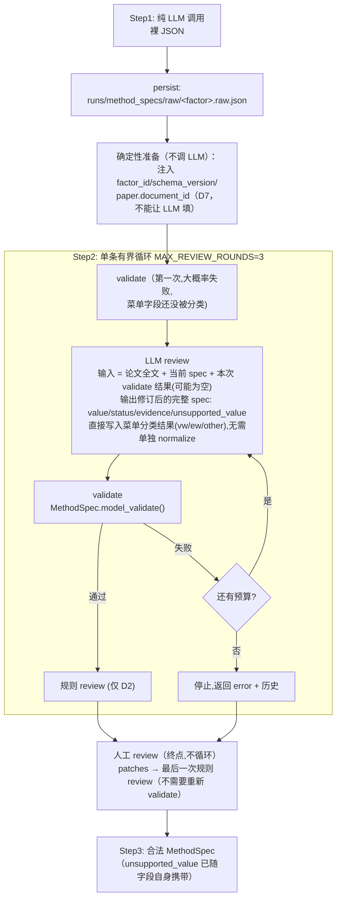

# Plan: 精简 Step1 提取器 + Step2 承担 validate/review 及单条有界循环

状态：已实施（2026-08-10）——见 CHANGELOG.md 2026-08-10 条目与
docs/decision-log.md 同日条目。前端人工审核 UI（§5.1 四项契约）已跟进
（2026-08-11）。

> **2026-08-11 更新（重要，覆盖本文档 §4.3 的护栏描述）**：下面 §4.3
> "不整体信任 LLM 每轮重写的完整 spec——只合并它明确声明改动的字段"这条
> 护栏**已被移除**，改为"整份直接信任 + 前端 diff 展示"——LLM 每轮重写的
> spec 现在整份直接生效（仅 `factor_id`/`schema_version`/`paper.document_id`
> 三个 D7 字段仍强制确定性注入）。`field_assessments`/`value_corrections`/
> `evidence_assessments` 降级为解释性注释，不再是生效开关；循环出口条件
> 也相应从"没有声明的新修正"改为"这一轮 diff 为空"。人工的角色从"逐条
> accept/reject value_corrections"变成"看前端的 diff 高亮，自己核对每一处
> 改动"。完整取舍讨论见 `docs/decision-log.md` 2026-08-11 "Replaced Step2's
> merge guardrail with full-trust + mechanical diff" 条目；本文档下方 §4.2/
> §4.3/§5 涉及"仅提议、人工确认"的描述均已过期，仅供历史参考。

## 目标

把所有"正确性"工作从 Step1 移到 Step2：

- **Step1** = 一次纯 LLM 调用,产出**裸 dict**。不做 `normalize_engine_vocabulary`,
  不做 `_repair_bare_sourced_scalars`,不做 `MethodSpec.model_validate()`。原样落盘。
- **Step2 也不做确定性 normalize**。菜单类字段（`weighting`/`construction_type`/
  `breakpoints.basis`/`missing_policies[].action`）的"论文措辞 → 引擎菜单 token"分类
  完全交给 LLM reviewer 判断（不再靠 `_WEIGHTING_SYNONYMS` 这类硬编码同义词表）。
  LLM 直接在它输出的 spec 里写入分类结果（`vw`/`ew`/`other`），**自动生效,无需人工
  确认**——这是机械式分类（把论文已经说清楚的选择归进正确菜单桶），不是推测论文本意的
  经验判断，性质与旧的 `normalize_engine_vocabulary` 相同，只是执行者从硬编码函数
  换成了 LLM。
- **`SourcedValue` 本身新增 `unsupported_value: str | None = None` 字段**（直接加在
  通用泛型基类上，不新建子类），取代原来计划里另存一份
  `MethodSpec.unsupported_fields` 列表的方案 —— 论文原始措辞与它归属的字段存在
  同一个地方，不需要跨结构对照（详见步骤 1）。对绝大多数非菜单字段来说这个
  字段永远是 `None`，只对 `weighting`/`construction_type`/`breakpoints.basis`/
  `missing_policies[].action` 这几个菜单类字段有实际意义。
- **从 Step1 提取开始就已经存在**：虽然 Step1 不 validate，但 `splice_schema_skeleton`
  自动从 `MethodSpec` 模型渲染骨架，新字段会自然出现在 Step1 的 prompt 里，LLM 在
  第一次提取时就可能已经尝试填写它（不强制、不校验，但 Step2 有一个现成的起点
  可以核对，而不是从零开始）。
- **删除 D4**（`review.py` 的 `_capability_findings`）。不在引擎菜单里的值归类成
  `other`/`unspecified` 并**记录**在字段自己的 `unsupported_value` 里；**不拦截**。
- **放宽 D2**：`DISPOSITION_MATRIX` 中 `(TABLE_ONLY, HIGH)` 由
  `NEEDS_HUMAN_CONFIRMATION` 改为 `AUTO_APPROVE` —— `clear` 与 `table_only` 都属于
  "论文确实说了"（只是一个在正文、一个在表格),其余三种状态才是"论文没明说,需要判断力"。
- **LLM review 审核整份 MethodSpec**,逐字段核对 `value` / `status` / `evidence`
  三项（详见步骤 4）。
- **菜单类字段的 Enum 类型保持不变**。因为 Step1 不再 validate,论文原始措辞天然保留在
  裸 JSON 里；LLM review 直接把这个字段分类写成菜单成员（`vw`/`ew`/`other`）,validate 只会看到
  分类后的合法值 —— 无需放宽类型。
- **`factor_id`/`schema_version`/`paper.document_id` 仍然不能让 LLM 填**（D7）：
  旧 `build_method_spec()` 删除后,这三个字段的确定性注入改由 Step2 循环入口函数在
  **第一次 validate 之前**完成（见步骤 4 的“0. 确定性准备”）——否则预检 validate 会因为
  缺失必填的 `factor_id` 而报错，这条错误跟论文/提取质量无关，会混进 LLM 看到的
  错误列表里形成噪声。

## 改造后的架构



### 循环设计要点

- **validate 跑在每一次 LLM review 之前,不是之后**：包括第一轮——裸 JSON 一落地就先跑
  一次 `model_validate`（此时菜单字段大概率还是论文原始措辞,几乎必定报错),把这份具体的
  `ValidationError` 列表连同论文全文一起作为第一轮 LLM review 的输入,而不是让 LLM 盲审。
  这样"第一轮没有错误信息、第二轮起才有"的不对称消失了——每一轮都是"先看 validate 结果,
  再审"，统一处理。
- **只有一条循环**。LLM review 同时承担"语义核对"和"结构修复"两件事 —— 每次都把最新一次
  validate 产生的**错误日志原文**（`ValidationError` 文本,可能为空)追加进 prompt,让同一个
  reviewer 一并修掉。菜单类字段的分类不再是一个独立的确定性步骤,而是 LLM 写 spec 时
  自然完成的一部分。
- **循环出口**：`model_validate` 通过 且 本轮 LLM 没有提出新的修正 → 退出;
  预算耗尽仍未通过 → 返回带 `error` 的结果（**不抛异常**),交人工处理。
- **人工审核是终点,不参与循环**：人改完之后只做一次规则 review（不需要重新 `model_validate`,
  理由见 §5 的提示框）,
  不会再回头问 LLM（否则 LLM 可能把人刚否决的值又提议一遍）。

## 实施步骤

### 1. `SourcedValue` 新增 `unsupported_value` 字段（`src/infra/models/method_spec.py`）

```python
class SourcedValue(BaseModel, Generic[T]):
    value: T | None = None
    evidence: list[EvidenceCitation] = Field(default_factory=list)
    status: EvidenceStatus = EvidenceStatus.UNSPECIFIED
    unsupported_value: str | None = None  # 新增：仅当 value=="other" 时非空
```

- 直接加在通用 `SourcedValue[T]` 基类上，**不新建子类**——对大多数字段来说这个字段
  永远保持 `None`，代价小，换取的好处是不用引入第二个包装类型。
- **字段类型全部保持不变**（包括 `WeightingScheme` / `ConstructionType` /
  `BreakpointBasis` / `MissingActionScheme` 这几个菜单类 Enum）—— 见目标章节的说明。
- 新增一个跨字段一致性校验器（`@model_validator`）：`unsupported_value` 非空时
  `value` 必须是 `"other"`，`value != "other"` 时 `unsupported_value` 必须为 `None`。
  只对存在 `unsupported_value` 概念的那几个菜单字段生效（其他字段本来就不会把
  `unsupported_value` 填非 None，这条校验实际上不会触发）。

### 2. 把 Step1 精简为一次纯 LLM 调用（`src/steps/step1_extractor/extractor.py`）

- `MethodSpecExtractor.extract()` 返回**裸 dict**（外加 token usage / error）;不再调用
  `build_method_spec`,不做校验。`ExtractionResult.spec` → `raw_spec: dict | None`。
- **删除**（不是迁移）`normalize_engine_vocabulary`、`_normalize_*` 这几个确定性归一化
  函数——菜单分类完全交给 Step2 的 LLM review 判断。`_repair_bare_sourced_scalars` 也
  删除,同类的结构问题现在走 §4 的 error_log 循环修复。
- 裸 JSON 落盘到 `runs/method_specs/raw/`。

### 3. 删除 D4 / 放宽 D2（`src/steps/step2_reviewer/review.py`）

- 删掉 `_capability_findings` 及其在 `_compute_findings` 中的调用;`ENGINE_*_MENU`
  常量保留作为 LLM review 判断"这个值该归入哪个菜单桶"的参考（不再用于确定性
  normalize 函数，而是写进 review prompt 告诉 LLM 合法菜单是什么）。
- **保留** `universe.filters[].concept_id` 不在 `data.fields` 里 那条检查,但改归类为
  `kind="missing_mapping"` / `NEEDS_HUMAN_CONFIRMATION`——它防的是 Step3 **硬崩溃**,
  不是静默 clamp,和"引擎菜单缺口"性质不同。
- 确认 review 不再产出 `BLOCKED` 之后,`ResolvedMethodSpec.is_ready` 行为仍然合理
  （它还会检查 `unmapped_concepts()` 与 `_construction_within_capability()`）。
- 同时放宽 D2：`src/infra/models/method_spec.py` 的 `DISPOSITION_MATRIX` 中
  `(EvidenceStatus.TABLE_ONLY, EMPIRICAL_IMPACT_HIGH)` 由 `NEEDS_HUMAN_CONFIRMATION`
  改为 `AUTO_APPROVE`（一行改动 + 对应测试）。理由：`clear` / `table_only` 的分界是
  "论文写在正文还是表格里",而不是"论文有没有说" —— 后三种状态才是真正需要人的判断力。

### 4. 单条循环：LLM review → validate（`src/steps/step2_reviewer/spec_build.py`）*(依赖 1-3)*

```python
build_reviewed_method_spec(
    raw, document_id, target_name, paper_text,
    llm_client, max_rounds=3, log=None,
) -> SpecBuildOutcome
    # .spec | .review | .history: list[ReviewRound] | .error
```

#### 4.0 确定性准备（循环开始前,不调 LLM）

旧 `build_method_spec()` 删除后，这几个字段现在没人注入了 —— 必须在 `build_reviewed_method_spec`
开头、**第一次 validate 之前**补上：

```python
raw["factor_id"] = MethodSpec.make_factor_id(document_id, target_name)
raw["target_name"] = target_name
raw["schema_version"] = "methodspec.v2"
raw.setdefault("paper", {})
raw["paper"].setdefault("document_id", document_id)
```

这三个字段按 D7 原则永远不能让 LLM 填（防止它编造不稳定的 ID）。不补这一步的话,
第一次预检 validate 会因为缺失 `factor_id`（必填字段,无默认值）而失败——但这个失败跟
论文内容/LLM 提取质量完全无关,纯属噪声,会混进第一轮 LLM review 看到的错误列表里。

`splice_schema_skeleton`（§4 下面描述的复用机制）已经会从渲染的骨架里剔除 `factor_id`/
`schema_version`（`render_schema_skeleton_block()` 里的 `skeleton.pop(...)`），所以 LLM 看到的
prompt 里本来就不包含这两个字段，不会被误导去填它们——但**真实的值**仍然需要上面这几行
确定性代码来填,因为 `model_validate` 需要它们真实存在，光靠"prompt 里不提"不会自动补上。

**Step2 review prompt 复用 Step1 的 schema 骨架拼接机制**
（`src/infra/models/schema_render.py::splice_schema_skeleton`）：review 的 system prompt
除了论文全文 + 当前 spec + 审核任务说明外,也拼进同一份自动生成的 `MethodSpec` JSON 骨架,
并显式列出 `model_validate` 会检查的硬性约束（不能输出裸标量、不能新增骨架之外的字段、
`step_id`/`concept_id`/`sort_id`/`leg_id` 不重复、`condition_on_sort_id`/`leg.selector`
只能引用已存在的 `sort_id`、`table_only` 必须带 `table_ref`、`primary_metric_id` 必须在
`metrics` 里、`estimated` 类目必须有 `estimation`)。

这不能替代 `model_validate` 本身（跟 Step1 §1.4a 的教训一样,prompt 说清楚规则不等于
LLM 100% 遵守),但能显著降低 validate 失败的**频率**,让"验证失败就交给人"这条分支
更少被触发。

每一轮的顺序（**validate 在前,LLM review 在后**）：

1. **validate** —— `MethodSpec.model_validate()`。第一轮对着 Step1 的裸 JSON 跑
   （菜单字段还没分类,大概率失败）;之后每轮对着上一轮 LLM 输出的 spec 跑。失败时把
   `ValidationError` 的完整文本存进 `error_log`（通过则 `error_log` 为空）。
2. **LLM review** —— 输入 = 论文全文 + 当前 spec JSON + **本次 `error_log`**
   （可能为空）。LLM 直接输出修订后的完整 spec,包括菜单类字段的分类结果与对应的
   `unsupported_value`。审核范围与输出契约见 §4.1 / §4.2。
3. **应用 LLM 的修正** —— `field_assessments`（status）与菜单分类/结构修补直接应用
   （机械式分类,不需人工确认）;`value_corrections` 只记录为待人工确认的提议,
   **不写入**（见 §4.2)。
4. **判定**：
   - 上一步 validate（步骤 1）已经通过 **且** 本轮 LLM 没提出新的修正 → 退出循环,
     进入规则 review。
   - 否则,若还有预算 → 回到第 1 步,重新 validate 这一轮 LLM 刚输出的 spec。
   - 预算耗尽仍未通过 validate → 返回带 `error` 的 outcome（**不抛异常**),连同完整
     `history` 一起交给人工处理。

**为什么把 validate 挪到 LLM review 之前**：这样每一轮都是同一种形状（先看 validate
结果,再审),不存在"第一轮没有错误信息、第二轮起才有"的特例——第一轮 LLM review 也能
直接看到一份具体的 `ValidationError` 列表（哪些菜单字段还没分类、哪里缺包装),而不是
凭空盲审,更可能一次性把大部分问题连同经验值一起修掉。

**为什么只需要一条循环**：菜单分类不再是一个独立的确定性步骤,而是 LLM 写 spec 时
自然完成的一部分（就像它会写 `value`/`status` 一样写 `unsupported_value`),不存在
"归一化后看不到论文原文"的问题——LLM 每轮都直接拿到论文全文。validate 失败产生的是
**确定性、机器可读的 `ValidationError` 文本**,直接回喂给同一个 reviewer 修就行。

契约对齐现有 `src/infra/repair.py::RepairLoop`：有界重试、每轮重新计算、
`history` 审计记录、可选 `log` 回调（接 SSE 实时进度）、预算耗尽返回 `error` 而不抛异常。

#### 4.1 LLM review 的审核范围：**整份 MethodSpec**

LLM 拿到的输入是**论文全文 + 完整 MethodSpec JSON**（不再只是 9 个高影响字段的
snapshot）。它需要对 spec 里的**每一个** `SourcedValue` 字段,逐一核对下面三项：

| 核对项 | 对应结构 | LLM 要回答的问题 |
|---|---|---|
| **value（格式）** | `SourcedValue.value` | 这个值的**形状/类型对不对**：该是数字就不能是字符串,该是 `SourcedValue` 包装就不能是裸标量,菜单类字段该写哪个 token 就不能写自由文本近似词。 |
| **value（准确性）** | `SourcedValue.value` | 抛开格式,这个值本身**和论文说的一致吗**？是不是读错/看串行/单位搞错了/张冠李戴？ |
| **status** | `SourcedValue.status` | 这个可信度评级**准不准**：论文明明白白写了却标成 `unspecified`;或论文根本没说、只是推断却标成 `clear`;或两处矛盾却没标 `conflicting`。 |
| **source** | `SourcedValue.evidence[]` | 引用的那句话/那个表格是否**真实存在**于论文中（不是 LLM 编造的引文）,并且**真的支撑**这个 value（不是文不对题、张冠李戴的引用),`table_ref` 指的表/行/列**准确无误**。 |
| **unsupported_value** | `SourcedValue.unsupported_value` | 归类结果为 `other` 时,这里是否忠实记录了论文的**字面描述**（不是空的、不是编造的）；`value != "other"` 时,这里必须是 `None`（不能残留上一次的措辞)。 |

> **对每一项都要求"准确",而不是"看起来合理"**：LLM 不能因为一个值"读起来像那么回事"
> 就判定通过——`value` 必须能追溯到论文里一个具体、可验证的出处（`clear` 的引文必须是
> 逐字可搜索的原文子串;`table_only` 必须真的指向一个存在的表格单元格),status 必须如实
> 反映这份出处的强弱,不能为了让流程走得更顺而虚报成更高的可信度。

除逐字段核对外,LLM 还要做**跨字段一致性**检查（例如 formula 里引用的变量与
`data.fields` / `universe` 声明是否自洽、三段 sample 期间是否互相矛盾、
`portfolio.legs` 的多空方向与 `signal.direction` 是否冲突)。

重试轮次还要额外处理 `error_log` 里的**结构性问题**（缺失的 `SourcedValue` 包装、
多余字段、类型不匹配等),但**只允许修结构,不得借机改动经验值**。

**重点关注字段**（易错区域,在 prompt 里显式列出提醒 LLM 多花注意力,但不限制它只看这些）：

- `signal.formula.steps[].expression` —— 公式每一步与论文描述是否一致、顺序对不对
- `signal.estimation` —— `category == "estimated"` 时是否填写、估计/测量窗口是否匹配论文
- `data.fields[].paper_source_hint` —— 数据源描述是否真的对应论文所述
- `sample.data_coverage` / `sample.formation` / `sample.reported_returns` —— 三者是否互相一致
- `reported_results.metrics` —— `primary_metric_id` 是否对应论文头条结果、`adjustment_model` 对不对
- `portfolio.legs` —— 多空腿选择器方向有没有搞反
- 菜单类字段（`weighting` / `construction_type` / `breakpoints.basis` /
  `missing_policies[].action`）—— 分类是否正确,`value == "other"` 时 `unsupported_value`
  是否准确记录了论文字面描述

#### 4.2 LLM 输出契约

在现有 `field_assessments` / `additional_findings` 之外,新增两类结构,合计四类：

| 输出项 | 作用 | 生效方式 |
|---|---|---|
| `field_assessments` | 提议新的 `EvidenceStatus`（status 轴） | 走 `DISPOSITION_MATRIX` 重算,可自动生效 |
| `value_corrections` | 提议纠正 `value`(带 `proposed_value` + `reason` + 论文引用) | **仅提议**,须人工确认才写入 |
| `evidence_assessments` | 指出某条 `evidence` 不成立/文不对题/引文伪造 | 降级该字段 status → 走矩阵重算 |
| `additional_findings` | 任意字段的跨字段不一致 | 恒为 `NEEDS_HUMAN_CONFIRMATION` |

> 菜单类字段的分类（`vw`/`ew`/`other`）与对应的 `unsupported_value` **不是**上表里的
> 一个独立输出项,而是 LLM 直接写在它重新提交的 spec JSON 里的普通字段值——跟它写
> `signal.direction`/`timing.holding_period` 的方式完全一样,机械式分类,自动生效,
> 不需要人工确认。

**权限边界（不变）**：LLM 永远不能直接写 `disposition`、不能自行批准放行、不能自己把
`value_corrections` 落盘。它只能改变判断的**输入**,最终结论仍由 `DISPOSITION_MATRIX`
（确定性查找表）或人工确认产生。

#### 4.3 护栏

- 应用 LLM 修正时复用现有补丁机制：把 `apply_human_value_patches` 泛化为
  `apply_value_patches(..., source="llm"|"human")`,两种来源走同一套字段白名单与类型强转
  逻辑。
- 新增测试确保 `unsupported_value` 与 `value` 的一致性校验器（步骤 1）在
  `model_validate` 层面确实生效,不依赖 LLM 自觉遵守。
- **不整体信任 LLM 每轮重写的完整 spec——只合并它明确声明改动的字段**：LLM 每轮虽然
  输出一份"修订后的完整 spec"，但 `build_reviewed_method_spec` 只把
  `field_assessments`/`value_corrections`/`evidence_assessments` 里明确列出的
  `field_path` 对应的那部分内容,从 LLM 的输出里摘出来合并进当前 spec;**其余所有字段
  一律强制沿用上一轮的值,完全忽略 LLM 在那些字段上写了什么**。防止 LLM 在"重写全文"
  时顺手漂移了它本不该碰的字段（比如这轮本来只该改 `weighting`，却在整体重写时不小心
  把 `signal.formula` 的某个引用文本改了）。新增测试：LLM 输出里对一个未在任何
  结构化列表中出现的字段做了改动，验证该改动被丢弃、最终 spec 里这个字段仍是上一轮的值。

### 5. 人工 review（`review.py` + `backend/routers/methodspecs.py`）

人工审核是**终点**,不参与循环：人工补丁 → **一次**最终规则 review（**不需要重新
`model_validate()`**——理由见下）。绝不自动回流到 LLM 循环（重新问 LLM 有可能把人刚
否决的值再提议一遍）。

> **为什么补丁之后可以跳过 `model_validate()`**：`apply_value_patches(source="human")`
> 只能改 `_high_impact_sourced_values` 这个固定的 9 个 leaf 字段（见 §5.1），且
> `_coerce_to_current_type` 在赋值前就已经强制做了类型检查（转换失败直接 `raise`，
> 非法值不会写进去）。查一遍现有的跨字段一致性校验器（`_step_ids_unique`/
> `_concept_ids_unique`/`_sort_and_leg_ids_unique`/`_table_only_has_table_ref`/
> `_primary_metric_exists`/`_estimated_category_requires_estimation`），没有一个依赖
> 这 9 个字段——校验器要检查的两类内容（跨字段一致性、单字段类型合法性）都已经被
> 白名单+强制类型转换提前覆盖了。**但仍然要重新跑规则 review**——这跟 validate 无关，
> 是因为 `MethodReview.findings`/`is_ready` 是现算的，人改完字段之后 disposition 必须
> 重新算才能反映"这个字段现在是 `CLEAR` 了"。**如果以后 `apply_value_patches` 的白名单
> 扩大到涉及跨字段校验器的字段（比如 `metric_id`/`sort_id` 这类），这个"跳过 validate"
> 的简化需要重新评估。**

**人工审核的范围与权限（重新限定）**：

- **只审 `_high_impact_sourced_values` 那个固定的高影响字段集合**，不是整份 spec
  （审整份 spec 是 LLM review 的工作，人工只针对 D2 矩阵会真正影响 disposition 的那少数
  字段。
- **人工只决定 `value`，不决定 `status`**。不再有 `apply_human_status_overrides` 这样
  让人工自己选 `EvidenceStatus` 的动作——人只需要确认/修正一个字段的最终值，**status 由
  系统自动盖章**（经人确认过的值自动标为 `EvidenceStatus.CLEAR`，同现有
  `apply_human_value_patches` 已经在做的事）——人不需要去理解/区分 `clear`/`table_only`/
  `inferred` 这些词汇，只需要判断"这个值对不对"。
- **LLM 仍可以在它自己那轮 review 里提议 `field_assessments`**（自动生效，走
  `DISPOSITION_MATRIX`）——这条限制只针对**人工**这步，LLM 的机制不受影响。

#### 5.1 每个高影响字段展示给人看的内容契约

人工审核界面对每个需要处理的字段，必须同时展示下面四项：

| 展示项 | 来源 | 说明 |
|---|---|---|
| **推荐值** | LLM review 输出的 `value_corrections`（若有），没有则显示当前值 | 默认预填在输入框/选中项里，人只需确认或换一个 |
| **其他可选值（下拉）** | 对 Enum 类型的字段，列出它的全部合法成员 | 复用 `src/infra/models/schema_reference.py::build_schema_reference()` 已经在算的 `allowed_values`，不新建一套 |
| **source** | 该字段的 `evidence[]`（`quote`/`table_ref`/`interpretation`） | 让人能回去核对论文原文，而不是千手相信 LLM |
| **字段解释** | 同一份 `build_schema_reference()` 的 `description`（`_FIELD_NOTES` 表） | 让人不需要去翻代码/文档就知道这个字段是干吗用的 |

> 这四项已经有三项现成机制可直接复用（`value_corrections`/`schema_reference.py` 的
> `allowed_values` 与 `description`/`SourcedValue.evidence`），只需要把三者拼到
> 同一个 per-field 响应结构里，不需要新建数据源。

#### 5.2 必须由人工处理的（阻塞项）

| 来源 | 具体内容 | 处理动作 |
|---|---|---|
| D2 矩阵 | 高影响字段 status 为 `inferred` / `unspecified` / `conflicting` → `NEEDS_HUMAN_CONFIRMATION` | 确认/修正 value（人不直接改 status，系统自动盖章） |
| LLM `value_corrections` | LLM 提议的每一条 value 纠正 | 逐条**接受或拒绝**（LLM 无权自行落盘） |
| LLM `additional_findings` | 跨字段不一致等 LLM 发现但无法自行解决的问题 | 判断并处理 |
| `missing_mapping` | `universe.filters[].concept_id` 不在 `data.fields` 中 | 补 `data.fields` 条目、或删除该 filter、或标 `accepted_unapplied` |
| 循环失败 | 预算耗尽仍无法通过 `model_validate` | 手工修正裸 JSON 或重跑提取 |

> 注：按本次改动,`status` 为 `clear` **或 `table_only`** 的高影响字段自动通过,不再需要
> 人工确认（这是 `DISPOSITION_MATRIX` 中 `(TABLE_ONLY, HIGH)` 从
> `NEEDS_HUMAN_CONFIRMATION` 改为 `AUTO_APPROVE` 的效果)。

#### 5.3 建议人工过目的（不阻塞,但默认展示）

- **全部高影响字段的现状快照**（value / status / evidence 三项),无论 disposition 是否
  已自动通过 —— 复用现成的 `_field_snapshot()`,把它作为 review 结果的一部分返回,
  而不是只在内部用于拼 LLM prompt。
- **`unsupported_value` 非空的字段清单**：所有 `value == "other"` 的字段及其
  `unsupported_value`（论文原始措辞）。虽然**不拦截**,但这是唯一能让人知道"论文的方法
  将被引擎近似执行"的地方,必须默认可见。
- **循环执行历史**（`history`：每轮的 error_log、LLM 提交了哪些修正),便于判断这份
  spec 是"一次就干净通过"还是"反复修补才勉强收敛"。

#### 5.4 人工可用的操作

| 操作 | 函数 | 作用范围 |
|---|---|---|
| 确认/修正 value | `apply_value_patches(source="human")` | 仅 `_high_impact_sourced_values` 里的固定字段集合（不接受任意 `field_path`，防止客户端传入攻击性属性路径）；提交后自动将该字段 `status` 置为 `CLEAR` |
| 接受 LLM 提议 | 上述函数的封装（预填 LLM 的 `proposed_value`，人直接确认即可） | 同上 |

### 6. 一致性收尾：不拦截（`spec_build.py` / `review.py`）

- `unsupported_value` 已随字段本身写好,不需要再单独收集/汇总成一份列表 —— Step3
  要用的时候,直接遍历 spec 里 `value == "other"` 的字段即可（可以提供一个便捷的只读
  辅助函数 `MethodSpec.unsupported_fields() -> list[tuple[str, str]]`,遍历自身,
  纯派生,不落盘新结构)。
- **不产生 disposition,不拦截**。Step3 的 `_clamp_with_provenance` 继续 clamp 并输出
  `config["defaults_applied"]`,该记录已经会流入 `comparison.json`。

### 7. 后端 API + 前端接线

- `POST /api/methodspecs/extract*` → 返回/持久化裸 JSON。
- `POST /api/methodspecs/review*` → 跑完整的单条循环,返回
  `{spec, review, history}`（`unsupported_value` 已经是 `spec` 自身的一部分,不需要
  单独返回）。
- `SessionDetailPage.tsx`：step1 展示裸 JSON（此时还没有合法 spec,不渲染
  `MethodSpecBoard`);step2 展示构建出的 spec + findings + `unsupported_value` 非空的
  字段高亮 + 现有的 per-field override/patch 控件。

### 8. 文档与变更记录

- `AGENTS.md` 的 module map 中 step1/step2 两行（step1 不再"产出 MethodSpec"）。
- `docs/decision-log.md`：记录"删除 D4"与"菜单分类改由 LLM review 直接判断（不再有
  确定性 normalize 函数）"这两项方法论层面的重大决策（AGENTS.md 强制要求）。
- `docs/architecture.md` §4.2a 与 `README.md` 中 `unspecified` vs `other` 那张表,
  目前描述的都是**旧的 D4 拦截行为**,需要更新。
- `CHANGELOG.md`。

## 涉及文件

| 文件 | 改动 |
|---|---|
| `src/infra/models/method_spec.py` | `SourcedValue` 新增 `unsupported_value` 字段 + 一致性校验器、`DISPOSITION_MATRIX` 一行改动 |
| `src/steps/step1_extractor/extractor.py` | 精简为纯 LLM 调用 |
| `src/steps/step2_reviewer/spec_build.py` | **新建**：validate + 单条循环 |
| `src/steps/step2_reviewer/review.py` | 删除 D4、删除 `apply_human_status_overrides`；新增 value/evidence 审核契约；`apply_value_patches(source=...)` 提交后自动置 `status=CLEAR` |
| `src/infra/models/schema_reference.py` | 复用（不改）：`build_schema_reference()` 的 `allowed_values`/`description` 供人工 review UI 展示 |
| `prompts/review_gate/llm_review.md` | 改写：全 spec 审核 + value/evidence 契约 + error_log 修复指引 |
| `prompts/extractor/method_spec_extractor.md` | 删掉"必须写精确菜单 token"的 §1.7a/1.7b/1.7c |
| `backend/routers/methodspecs.py` | 端点行为调整：人工审核端点只接受 value patch，不再接受 status override |
| `frontend/src/pages/SessionDetailPage.tsx` | step1/step2 展示调整；step2 人工审核卡片改为「推荐值 + enum 下拉 + source + 字段解释」四件套 |
| `tests/test_step1_extractor*.py` 等 | 见下方验证 |

## 验证方式

1. `pytest tests/ -q` —— **全量**（改动了共享 schema,按 AGENTS.md 必须跑全量,
   而不是只跑窄范围）。预计 spec 构造类测试会有较大改动量。
2. `ruff check src/`。
3. `python scripts/validate_methodspecs.py` 跑一遍现有 `runs/method_specs/` 产物。
4. 新增专项测试：
   - 一致性校验器：`unsupported_value` 非空时 `value` 必须是 `"other"`,反之亦然。
   - 循环：含裸 `formation_month` 的裸 dict 能在预算内收敛;完全无救的 dict 在预算耗尽后
     返回 `error`（而非抛异常）。
   - 循环：LLM 连续两轮提出同一条修正时,一轮后即终止。
   - 循环：`model_validate` 失败时,`ValidationError` 文本确实被传进**同一轮**的 LLM
     review 输入（而不是要等下一轮才看到）,且同一个 reviewer（不是另一个专门的修复
     函数）能据此修正。
   - 循环：第一轮对 Step1 裸 JSON 的 pre-flight validate 确实先跑,其结果（哪怕是
     `ValidationError`）被塞进第一轮 LLM review 的输入里。
   - `factor_id`/`schema_version`/`paper.document_id` 在第一次 validate 之前就已经被
     确定性注入（§4.0），即使一份提取质量完美的裸 JSON，第一次预检也不会因为缺失这三个
     字段而报错；且不管 LLM 在它重写的 spec 里对这三个字段写了什么，最终落盘的值都是
     确定性注入的那份，不是 LLM 自己写的。
   - LLM 的 `value_corrections` **不会**被自动写入 spec（必须经人工确认才生效）。
   - `(TABLE_ONLY, HIGH)` 现在自动通过,不再产生 finding。
   - LLM 归类菜单字段为 `other` 时,能正确填写 `unsupported_value`（保留 `capped_vw_at_5pct`
     这类论文原始措辞，不是空白或编造内容）。
   - `apply_value_patches(source="human")` 提交后自动将 `status` 置为 `CLEAR`，人工无需
     也无法传入其他 `EvidenceStatus`。
   - 人工审核的候选字段集合 = `_high_impact_sourced_values`，不包括其他字段（确认
     范围真的被限定住了）。
5. 手动：用真实论文跑一次 extract→review,先
   `export FACTOR_AGENT_RUNS_DIR=.runs_scratch`,结束后 `rm -rf .runs_scratch`。

## 关键决策

- **没有单独的 normalize 步骤**：菜单分类完全交给 LLM review 判断,直接写进它重新提交的
  spec 里。正因为没有另外一个确定性步骤会把论文原文"抹平"（比如把 `capped_vw_at_5pct`
  提前变成 `other`），LLM 每轮都直接拿到论文全文，**循环才能在 `model_validate` 失败后
  直接把 `ValidationError` 回嗂给同一个 reviewer，而不需要担心它重试时看不到原始信息**。
- **只用一条循环**（LLM review → validate → 失败就带 `error_log` 重试）而不是拆成
  结构/语义两条：`model_validate` 失败产生的错误本身就是确定性、机器可读的文本,直接
  回嗂给同一个 reviewer 更简单。
- **人工 review 是终点**,不回流进 LLM 循环。
- **人工只决定 value,不直接选 status**：`EvidenceStatus` 的五个枚举值对人来说是实现
  细节，不是人真正关心的事情——人只需要回答"这个值对不对"，确认过就自动算 `CLEAR`
  （因为人已经亲自确认过，这是最强的证据等级）。去掉 `apply_human_status_overrides`。
- **人工审核范围限定在高影响字段**（与 LLM 审整份 spec 形成分工），每个字段必须
  同时展示推荐值/enum 下拉/source/字段解释四项，全部复用现成机制（`value_corrections`/
  `schema_reference.py`/`SourcedValue.evidence`），不新建数据源。
- **保留** `universe.filters` ⊄ `data.fields` 检查（改归 `missing_mapping`),即使 D4 其余
  部分删除 —— 它防的是硬崩溃,不是静默 clamp。
- **不在菜单里的值记录后放行**（用户明确决定)。接受的风险是：论文声明的方法被引擎静默
  近似,只能在字段自己的 `unsupported_value` / `config["defaults_applied"]` 里看到
  —— 这一点写进 decision log。

## 后续待议

1. **`comparison.json` 是逐 factor 覆盖写的**,一条已记录的替换可能在下一个 batch 跑完后
   被冲掉。是否要把 `unsupported_fields` 提升为 Step7 `ReplicationDiff` 输出里的一级
   caveat？建议：要做,但作为本次重构**落地之后的独立任务**（方案 A);放进同一次改动
   （方案 B）会让本就很大的改动更臃肿。
2. **影响面排查**：`docs/architecture.md`、`README.md`、
   `prompts/review_gate/methodspec_audit.md` 目前都在描述现行的 D4 拦截 +
   `unsupported_fields` 语义。建议动手前先用 subagent 扫一遍,列出所有断言 D4 拦截行为的
   文档/prompt/测试（方案 A);而不是等测试挂了再被动修（方案 B,更快但会留下过期文档）。
3. 成本：循环每多跑一轮就多一次带论文全文的 LLM 调用（参照真实测过的 ~137k 字符论文,
   单次提取就 >600s）。**用户确认：不做"只发变更摘要"这类省 token 优化，每轮仍然完整
   发送论文全文**，先用最简单的方案跑起来，有实际成本数据了再说。`MAX_REVIEW_ROUNDS`
   **定为 3**（预检 1 次 + 重试 3 次 = 最多 4 次带全文的调用，比之前建议的 2 多一轮容错
   空间，不再对齐 `MAX_REEXTRACT`/`MAX_REPAIR_RETRIES` 的 2，属于专门为这个循环单独设
   的值），可配置;每轮的 token usage（复用 `extract_usage()`）记录进 `history`,便于事后
   看这份 spec 到底烧了多少调用/token。
4. **循环历史（`history`）要不要落盘,还是只在这次 API 调用里返回一次**：如果只返回一次,
   用户如果没在当次请求里看完/职后重开页面就找不到"这份 spec 到底改过什么、哪几轮
   validate 失败过"。建议：像其他步骤一样落盘一份审计文件（例如
   `runs/method_specs/review_history/<factor_id>.json`），`log` 回调继续接 SSE 做
   实时进度，落盘的文件供事后查看，两者不冲突。
